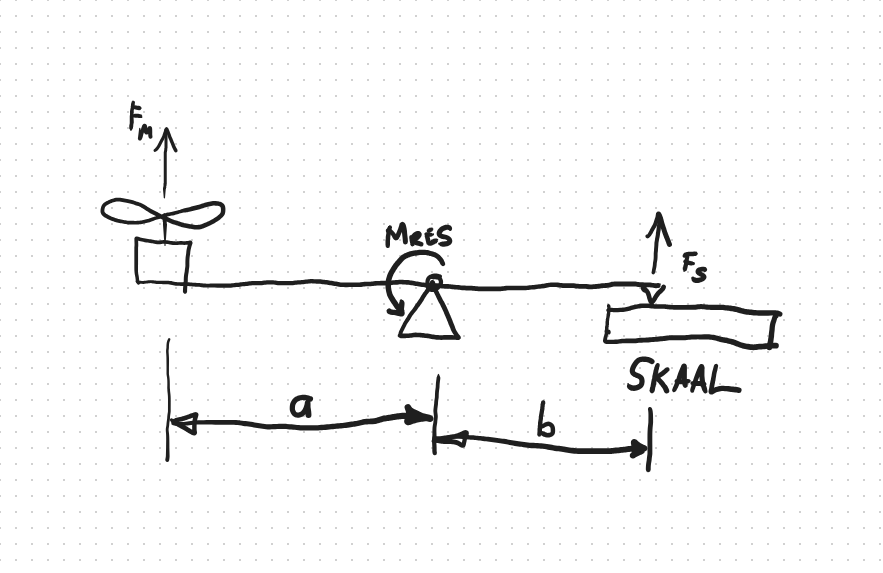
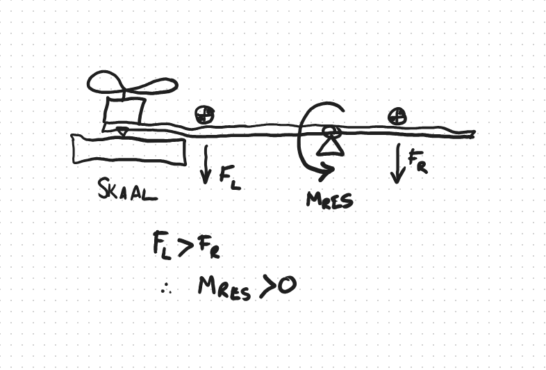

# Meet stukrag van motor

Meet stukrag met die volgende opstelling.

Dit is nodig om te weet of die motor dalk te min krag gee om die Fogey gestadigd met reguitvlug kan laat vlieg.

Maak seker dat die skroef nie in grondeffek is nie.

Die skarnier moet ook toelaat om die massa van die krag wat oorkom moet word gemeet kan word.

Meet die eie massa (oftewel moment) van die balk massa en die motor.  Met hierdie meting is die motor natuurlik af.

Hou rekening met $M_{RES}$ by die moment wat die stukrag genereer.  Dan kan $F_M$ uit die volgende vergelyking verkry word:
$$
F_S b + M_{RES} = F_M a \\
\therefore F_M = \frac{F_S b + M_{RES}}{a}
$$
waar $F_M$ die motor stukrag is en $F_S$ is die krag op die skaal.  $M_{RES}$ is die krag op die skaal wanneer net die motor (afgeskakel) en balk gemeet word maal met $a$.  Dit is die resultante moment met geen krag op nie.

